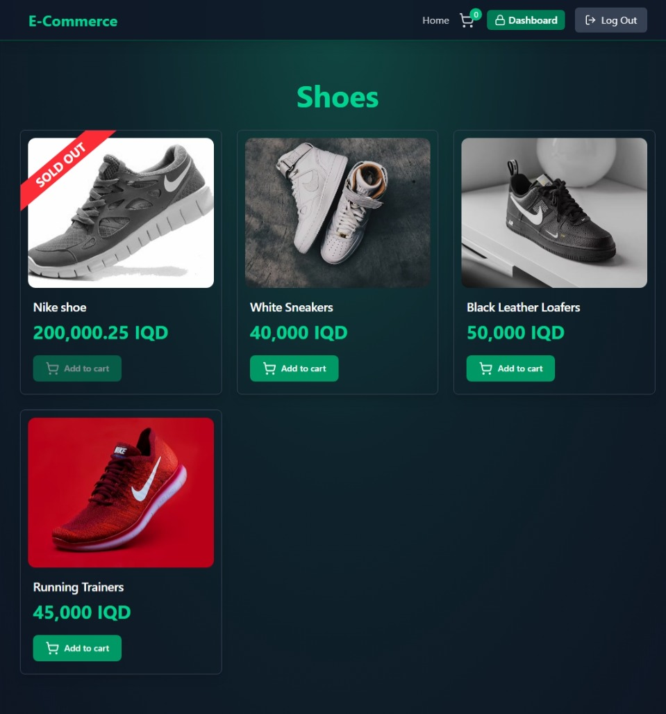
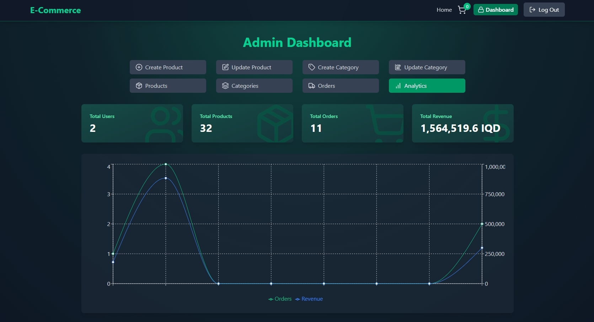
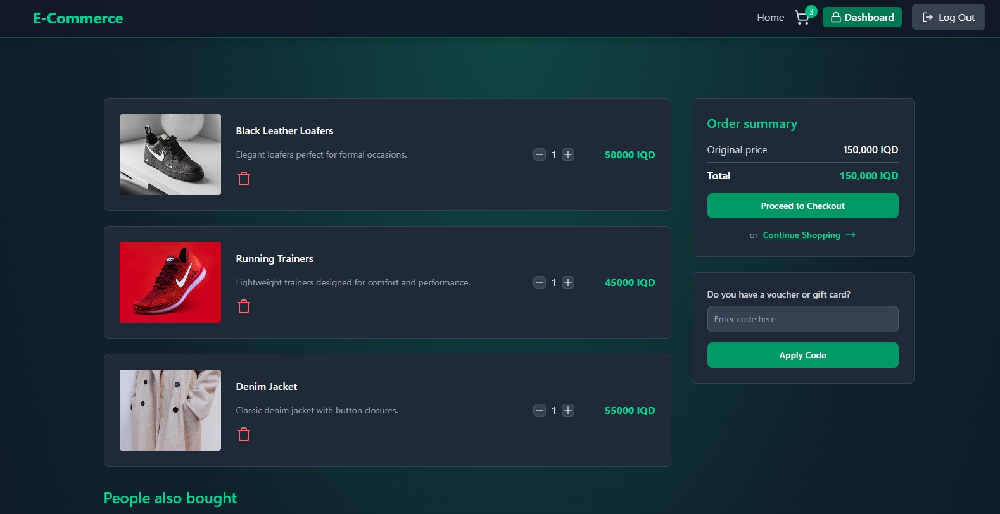

# 🛒 E-Commerce Store (MERN Stack)

A full-stack e-commerce web application built with React, Node.js, Express, and MongoDB.

## 🚀 Live Demo

🔗 [View Website](https://mern-ecommerce-website-store.netlify.app/)

## 📦 Features

- 🔐 Authentication & Authorization
- 🛍️ Product categories and filtering
- 🛒 Cart management
- 🧾 Order placement
- 🛠️ Admin dashboard
- 🌐 Fully responsive

## 🖼️ Screenshots

### Homepage

### Product Page

### Admin Dashboard

### Order Page

## 🧪 Tech Stack

- **Frontend**: React, Zustand, Axios, Tailwind CSS
- **Backend**: Node.js, Express
- **Database**: MongoDB
- **Deployment**: Netlify (Frontend), Render/Netlify (Backend)

